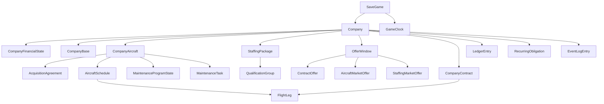

# Game State Model

## Purpose

This document defines the canonical state model for FlightLine MVP.

It sits between product strategy and implementation. The goal is to make later code, save data, generators, and UI all point at the same source-of-truth objects.

## Design Goal

The game state model should answer four questions clearly:

- what data is authoritative
- what data is generated and temporary
- what data is derived for UI convenience
- what changes when time advances

If those boundaries are unclear, the simulation will become hard to save, test, and explain.

## Modeling Principles

### 1. Separate reference data from save state

FlightLine already has large reference datasets for airports and aircraft.

Those datasets are not player-owned state. A save file should reference them, not duplicate them.

Reference data examples:

- airport facts and airport gameplay tags
- aircraft families, models, cabin layouts, and MSFS metadata

Save-state examples:

- company cash
- owned or leased aircraft
- staffing packages
- accepted contracts
- schedules
- maintenance status

### 2. Prefer durable facts over summary flags

The save model should persist facts and commitments first.

Examples:

- persist the scheduled legs on an aircraft
- persist the active maintenance booking
- persist the accepted contract terms

Then derive summary labels such as:

- `available`
- `tight`
- `due_soon`
- `warning`

This keeps the simulation explainable and reduces contradictory state.

### 3. Generated boards are part of state while visible

The visible contract board, aircraft market, and staffing market are not pure UI.

They affect player decisions, so the currently visible offer set should be saved with:

- generation timestamp
- seed or window id
- expiration rules
- accepted or expired outcome

That preserves exact board continuity across save and load.

### 4. Alerts are derived, events are durable

Alerts should usually be recomputed from canonical state.

What should persist is the event history that caused state changes, such as:

- contract accepted
- flight leg completed
- maintenance started
- payment posted
- staffing package expired

The inbox and dashboard can then derive current alerts from state plus recent events.

### 5. The simulation runs on discrete time jumps

FlightLine should not simulate every second.

The canonical model should support event-driven time advancement where the clock moves to:

- a player-selected target time
- the next scheduled operational event
- the next interruption condition

## State Layers

FlightLine MVP should use four state layers.

### 1. Reference Layer

Static or slow-moving data shipped with the game:

- airport reference database
- aircraft reference database
- static balancing tables
- generator archetype tables

### 2. Canonical Save Layer

The player company and world state for a save slot:

- company
- finances
- bases
- fleet
- staffing
- visible offers
- accepted work
- schedules
- maintenance
- game clock

### 3. Event History Layer

Append-only or mostly append-only records used for:

- auditing
- debugging
- summaries
- finance history
- player-facing event feed

### 4. Derived Read Layer

Non-authoritative projections used by UI:

- dashboard cards
- aircraft operational state labels
- staffing coverage bands
- alert groups
- profitability summaries
- "best fit" hints

## Save Boundary

One save slot should contain one simulated company state inside one world configuration.

Minimum save metadata:

- `save_id`
- `save_version`
- `created_at`
- `updated_at`
- `world_seed`
- `difficulty_profile`
- `reference_snapshot_version`

`reference_snapshot_version` should identify which airport and aircraft reference snapshots the save expects.

## Canonical Root Objects

The canonical save state should be anchored by these root objects.

### SaveGame

Top-level container for one player company run.

Responsibilities:

- identifies the save slot
- stores versioning metadata
- stores the active company id
- stores the world seed and ruleset references
- stores the active game clock

### Company

The primary strategic actor.

Minimum concerns:

- company identity
- reputation
- cash posture
- debt posture
- progression tier
- home region and airport footprint
- active policy toggles later

### GameClock

The single authoritative simulation clock.

Minimum concerns:

- current UTC timestamp
- local-display helpers derived from airport timezone
- time-stop preferences
- last time-advance result

All deadlines, departures, lease payments, and staffing terms should ultimately resolve against this clock.

## Core Entity Groups

### Company And Finance

#### CompanyProfile

Identity and progression-facing fields:

- company name
- branding later
- reputation score
- company phase
- unlocked systems later

#### CompanyFinancialState

The current financial position.

Minimum fields:

- current cash
- current credit usage later if enabled
- current financial pressure band
- maintenance reserve balance later if separated

#### LedgerEntry

Durable financial events.

Examples:

- contract revenue
- fuel expense
- airport fee
- payroll charge
- lease payment
- financing payment
- maintenance invoice
- insurance later

#### RecurringObligation

Future obligations that should not be flattened into one summary number.

Examples:

- operating lease
- financing payment plan
- staffing package fixed cost
- service agreement cost
- base overhead later

### Airport Footprint

#### CompanyBase

Player-controlled airport presence.

MVP fields:

- airport id
- role: `home_base`, `base`, or `focus`
- activation date
- local service modifiers later

This is separate from the airport reference record.

#### AirportRelationship

Optional lightweight company-memory table.

Examples:

- favored region
- recent performance in market
- local reputation later

This is useful for generation tuning without polluting airport reference data.

### Fleet And Airframes

#### CompanyAircraft

The owned, financed, or leased airframe in player control.

Minimum fields:

- aircraft id
- aircraft model id
- active cabin layout id where relevant
- tail or company identifier
- acquisition agreement id
- current airport id
- current schedule id if any
- current maintenance task id if any
- delivery state
- hours, cycles, and condition metrics

This entity should reference the aircraft database, not duplicate model facts like range or MTOW.

#### AcquisitionAgreement

Commercial terms for how the aircraft entered the fleet.

Supported MVP types:

- `owned`
- `financed`
- `leased`

Minimum fields:

- agreement type
- start date
- upfront payment
- recurring payment
- payment cadence
- end date if lease
- residual or buyout terms later

#### AircraftReadiness

This should usually be derived, not authoritative.

Examples:

- aircraft operational state
- staffing coverage flag
- maintenance state
- dispatch readiness

The durable inputs live on `CompanyAircraft`, schedules, staffing, and maintenance.

### Staffing And Labor

#### StaffingPackage

The canonical unit of purchased labor capability.

This is more useful for MVP than storing every named employee as a separate person.

Supported MVP sources:

- direct hire package
- contract crew package
- service agreement package
- outsourced maintenance package

Minimum fields:

- staffing package id
- labor category
- employment model
- qualification group
- coverage units provided
- fixed cost
- variable usage cost if any
- start date
- end date if temporary
- home region or service region

#### QualificationGroup

A stable reference concept used by both fleet and staffing.

Examples:

- Caravan-class pilot
- King Air-class pilot
- ATR-class pilot
- RJ-class pilot later
- cabin crew narrowbody later
- line mechanic regional later

#### LaborAllocation

A time-bounded commitment of staffing capacity to schedules or maintenance.

This is what allows the game to answer:

- is this schedule covered
- is staffing only barely covered
- what gets freed when a leg completes

#### StaffingCoverageView

Coverage states such as `covered`, `tight`, and `blocked` should be derived from:

- staffing packages
- qualification groups
- current allocations
- future schedule commitments

### Generated Offer Boards

#### OfferWindow

A container for one visible generation batch.

Recommended types:

- `contract_board`
- `aircraft_market`
- `staffing_market`

Minimum fields:

- offer window id
- window type
- generation seed
- generated at
- expires at
- player context snapshot hash later

#### ContractOffer

A generated opportunity not yet accepted.

Minimum fields:

- offer id
- offer window id
- contract archetype
- origin airport id
- destination airport id
- payload or passenger quantity
- earliest start
- latest completion
- payout
- risk band
- explanation metadata
- status: `available`, `shortlisted`, `expired`, `accepted`

#### AircraftMarketOffer

A generated aircraft deal visible to the player.

Minimum fields:

- offer id
- offer window id
- aircraft model id
- delivery airport id
- condition or age band
- acquisition structure
- upfront payment
- recurring payment
- estimated readiness date
- status

#### StaffingMarketOffer

A generated labor offer visible to the player.

Minimum fields:

- offer id
- offer window id
- staffing package template
- region
- qualification group
- capability summary
- fixed and variable cost
- start delay if any
- duration if temporary
- status

### Accepted Work And Operations

#### CompanyContract

The committed contract after acceptance.

This should lock the commercial terms that matter for execution.

Minimum fields:

- company contract id
- originating offer id if generated from the board
- archetype
- origin airport id
- destination airport id
- payload or passenger quantity
- accepted payout
- penalty model
- accepted at
- deadline
- current state

#### AircraftSchedule

An ordered plan attached to one aircraft.

Minimum fields:

- schedule id
- aircraft id
- schedule state
- planned start
- planned end
- validation status

#### FlightLeg

The smallest operationally meaningful movement unit in MVP.

Supported leg types:

- `reposition`
- `contract_flight`
- `maintenance_ferry`
- `positioning_support` later if needed

Minimum fields:

- leg id
- schedule id
- sequence number
- origin airport id
- destination airport id
- planned departure
- planned arrival
- assigned staffing requirements
- linked company contract id if revenue work
- current leg state

#### OperationalExecution

Execution records created as time advances.

Examples:

- departed
- arrived
- completed late
- cancelled
- failed due to staffing block
- failed due to maintenance AOG

This layer is durable history, not just UI telemetry.

### Maintenance

#### MaintenanceProgramState

Persistent condition and service-threshold state per aircraft.

Minimum concerns:

- current condition band inputs
- hours to service
- cycles to service later
- last inspection dates
- current AOG flag if any

#### MaintenanceTask

A planned or active maintenance action.

Minimum fields:

- task id
- aircraft id
- maintenance type
- planned start
- planned end
- service provider source
- cost estimate
- actual cost
- current state

#### MaintenanceProviderLink

Optional but useful for outsourced coverage.

Examples:

- base mechanic package linkage
- airport service coverage linkage
- turnaround capability later

### Events And Derived State

#### EventLogEntry

Durable record of important state transitions.

Examples:

- company created
- aircraft acquired
- staffing package activated
- contract accepted
- schedule committed
- leg departed
- leg arrived
- maintenance started
- payment charged

#### Alert

Alerts should not be the deepest source of truth.

Current alert state should be derived from:

- overdue or blocked commitments
- upcoming deadlines
- maintenance thresholds
- staffing shortfalls
- financial obligations

The alert hierarchy in [state-and-alert-model.md](/Z:/projects/FlightLine/strategy/state-and-alert-model.md) should be treated as a read model built from canonical state.

## Relationship Outline

## What Should Be Derived Instead Of Stored

These values should normally be derived at read time or cached as non-authoritative projections:

- aircraft operational state label
- staffing coverage label
- maintenance warning band
- alert priority
- contract "best fit aircraft"
- profit per hour summaries
- dashboard counts
- blocked-opportunity counts

If these are stored, they should be treated as rebuildable caches.

## MVP Command Boundaries

The canonical state model should support these primary write operations:

- create company
- add or remove base
- acquire aircraft
- retire or sell aircraft later
- activate staffing package
- expire staffing package
- accept contract offer
- commit aircraft schedule
- schedule maintenance
- advance time
- resolve interruptions

Each command should update canonical state first and let dashboards, alerts, and summaries react afterward.

## MVP Persistence Recommendation

FlightLine should eventually persist three buckets:

### Reference SQLite

Already present in the repo:

- airports
- aircraft

### Save SQLite

Should contain:

- company and finance tables
- fleet tables
- staffing tables
- offer-window tables
- contract and schedule tables
- maintenance tables
- game clock
- event history

### Optional Materialized Read Tables

Only if needed for performance later:

- dashboard summaries
- profitability rollups
- airport-pair usage stats

These should always be rebuildable from canonical state plus reference data.

## MVP Non-Goals

The canonical MVP model should not require:

- named individual staff biographies
- per-seat passenger booking simulation
- per-minute fuel burn simulation
- multiplayer synchronization
- direct simulator telemetry integration
- full airline route network planning

Those may be added later, but they should not distort the first save-state design.

## Success Test

This model is good enough for implementation when the team can answer these questions without inventing new objects:

- Where does the truth live for whether an aircraft can fly right now?
- Where does the truth live for whether a contract is still valid?
- Where does the truth live for whether staffing is actually available?
- Where does the truth live for the next lease payment?
- What exact data must be saved so load returns the same contract board and schedule state?

If any of those answers still depend on UI state or hand-wavy summaries, the model is not ready.
